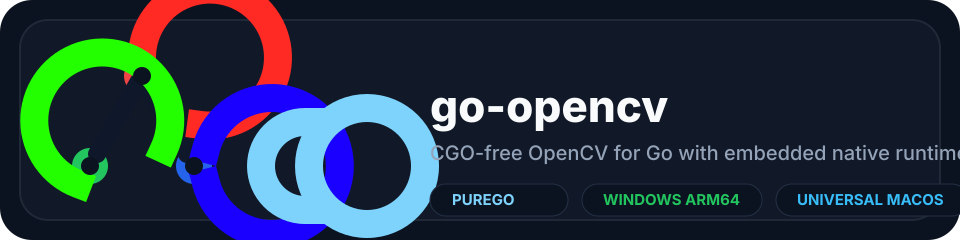

# go-opencv

<p align="center">
  
</p>

<p align="center">
  CGO-free OpenCV for Go with embedded native runtimes, purego loading, and a universal macOS dylib.
</p>

<p align="center">
  <a href="https://pkg.go.dev/github.com/brainplusplus/go-opencv"></a>
  <a href="https://goreportcard.com/report/github.com/brainplusplus/go-opencv"></a>
</p>

`go-opencv` wraps real OpenCV in a prebuilt native backend and loads it at runtime through [purego](https://github.com/ebitengine/purego). Consumers stay on `CGO_ENABLED=0`, ship a normal Go binary, and still get OpenCV-backed image processing.

The project uses [nihui/opencv-mobile](https://github.com/nihui/opencv-mobile) **4.13.0** as the upstream OpenCV distribution and embeds platform-specific native artifacts directly into the Go package.

## Why this project

- `CGO_ENABLED=0` for application builds
- Embedded native runtimes with automatic cache extraction
- Real OpenCV execution, not a partial pure-Go imitation
- Cross-platform release assets for Windows, Linux, and macOS
- Windows support for both `amd64` and `arm64`
- Universal macOS dylib with both `x86_64` and `arm64` slices
- Familiar OpenCV-style API for image I/O, color conversion, filtering, geometry, contours, drawing, and more

## Platform support

| Platform | GOARCH | Artifact | Status |
|---|---|---|---|
| Windows | `amd64` | `goopencv.dll` | Supported |
| Windows | `arm64` | `goopencv.dll` | Supported |
| Linux | `amd64` | `goopencv.so` | Supported |
| Linux | `arm64` | `goopencv-linux-arm64.so` | Supported |
| macOS | `amd64` | `goopencv.dylib` | Supported via universal dylib |
| macOS | `arm64` | `goopencv.dylib` | Supported via universal dylib |

More detail lives in [SUPPORTED_PLATFORMS.md](SUPPORTED_PLATFORMS.md).

## Install

Add the module to your project:

```bash
go get github.com/brainplusplus/go-opencv@v0.3.1
```

Then import it in your code:

```go
import opencv "github.com/brainplusplus/go-opencv"
```

There is no separate native runtime installation step for supported platforms. The package embeds the platform-appropriate backend and extracts it automatically on first use.

## Quick start

```go
package main

import (
	"context"
	"fmt"
	"log"

	opencv "github.com/brainplusplus/go-opencv"
)

func main() {
	cv, err := opencv.New(context.Background())
	if err != nil {
		log.Fatal(err)
	}
	defer cv.Close()

	img, err := cv.IMRead("photo.png")
	if err != nil {
		log.Fatal(err)
	}
	defer img.Close()

	blurred, err := cv.GaussianBlur(img, opencv.Size{Width: 5, Height: 5}, 0)
	if err != nil {
		log.Fatal(err)
	}
	defer blurred.Close()

	if err := cv.IMWrite("output.png", blurred); err != nil {
		log.Fatal(err)
	}

	rows, _ := blurred.Rows()
	cols, _ := blurred.Cols()
	fmt.Printf("wrote output.png (%dx%d)\n", cols, rows)
}
```

## Examples

The repository includes runnable examples in [examples](/D:/golang/go-opencv/examples).

From the repo root:

```bash
cd examples
go run . -demo=all
```

Useful variants:

```bash
go run . -demo=basic
go run . -demo=io -in sample.png -out output
go run ./tools/gen-sample
```

## What you get

### Image I/O

- `IMRead`
- `IMReadBytes`
- `IMWrite`

### Processing

- `CvtColor`
- `Blur`, `GaussianBlur`, `MedianBlur`
- `Threshold`, `AdaptiveThreshold`, `Canny`
- `Resize`, `Flip`, `Transpose`, `WarpAffine`, `WarpPerspective`

### Shape and drawing

- `FindContours`, `DrawContours`, `ContourArea`, `BoundingRect`
- `Rectangle`, `Circle`, `Line`, `ArrowedLine`, `PutText`
- `HoughLines`, `HoughLinesP`, `HoughCircles`

### Mat lifecycle

- `NewMat`, `Zeros`, `Ones`, `Eye`
- `Split`, `Merge`, `Region`, `Reshape`
- explicit `Close()` and `Delete()` ownership flow

The complete surface area is documented in [API_REFERENCE.md](API_REFERENCE.md).

## Runtime loading

`opencv.New()` follows a simple path:

1. select the embedded native library for the active platform
2. extract it into the user cache directory
3. load it through purego
4. bind the exported ABI symbols

You can override the embedded backend explicitly:

```go
rt, err := opencv.New(ctx, opencv.WithDLL("/path/to/goopencv.dylib"))
```

## Building native backends

Native backend builds are platform-specific.

### Windows

```powershell
build-tools\build-goopencv.bat
```

### Linux amd64

```bash
bash build-tools/build-goopencv-linux.sh
```

### Linux arm64

```bash
bash build-tools/build-goopencv-linux-arm64.sh
```

### macOS universal

```bash
bash build-tools/build-goopencv-macos.sh
```

The macOS build script produces a universal `dist/goopencv.dylib` and verifies that both `x86_64` and `arm64` slices are present.

All current release artifacts are built on top of `opencv-mobile 4.13.0`.

## CI and releases

GitHub Actions builds:

- `goopencv.dll` for Windows `amd64`
- `goopencv.dll` for Windows `arm64`
- `goopencv.so` for Linux `amd64`
- `goopencv-linux-arm64.so` for Linux `arm64`
- `goopencv.dylib` as a universal macOS artifact

Release uploads publish the macOS binary as `goopencv-macos-universal.dylib`.

## Testing

```bash
go test ./...
```

For local validation, `scripts/verify-backend.ps1` will run Go tests and report the size of any native backend found in `dist/`.

## Documentation

- [SUPPORTED_PLATFORMS.md](SUPPORTED_PLATFORMS.md)
- [API_REFERENCE.md](API_REFERENCE.md)
- [docs/architecture.md](docs/architecture.md)
- [docs/backend-abi.md](docs/backend-abi.md)
- [docs/interface-contract.md](docs/interface-contract.md)

## License

MIT
